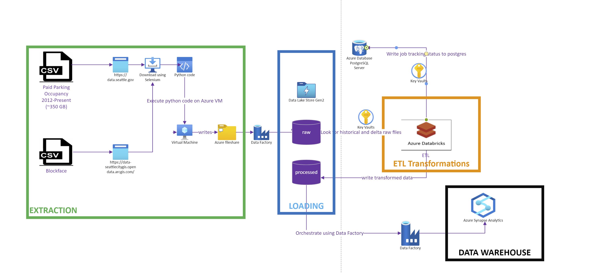

## Table of contents
* [General Info](#general-info)
* [Architecture](#architecture)
* [Overview](#overview)
* [Technologies](#technologies)
* [Execution](#execution)


## General Info
This project is Step 9- Deploy the Code and Process the Dataset for Open Ended project: Seattle Paid Parking Occupancy

<hr/>

## Architecture




## Overview
Car parking has been a major issue in urban areas worldwide. Most countries are facing issues related to the lack of parking places. With the increasing economic development and urbanisation, car ownerships are growing rapidly, which exacerbates the imbalance between parking supply and demand [1]. The Ministry of Public Security of China released data of car ownership nationwide in 2018, showing that the number of cars reached 240 million with an annual growth rate of 10.51%, but the total number of parking spaces was only 102.5 million including private and public parking spaces, which is lower than half of the total number of cars. Moreover, around 30% of the traffic congestion in Chongqing and Shanghai, major cities of China, is due to lack of car parking spaces [2]. This issue is mainly caused by ineffective parking management. According to the latest research report [3], the parking space utilisation rate of more than 90% of cities in China is <50%. With the limited areas in the cities, increasing parking area would not be a sustainable solution, but the implementation of efficient parking management would be a practical solution. The intelligent parking system is an essential part of efficient parking management. In intelligent parking system, the time-sensitive parking occupancy prediction will be of great significance for decision makers and city planners regarding parking.

The number of available parking spaces plays an important role in drivers’ decision-making processes regarding parking [4, 5]. According to Caicedo et al. [6], drivers that possess information on parking availability are 45% more successful in availing parking spaces than those without knowledge. Moreover, the parking occupancy prediction is helpful in transportation management and planning [7]. For instance, public agencies such as city traffic and planning departments use the predicted parking occupancy information to manage transportation demand and traffic congestion [8]. Parking facility managers and operators may foresee the parking system performance and carry out short- and long-term preventive strategic decisions to avoid system breakdowns [9]. On the other side, the parking occupancy prediction can help reduce traffic congestion and energy consumption [10]. According to a report [11], on an average, US drivers spend 17 h per year searching for parking spaces at a cost of $345 per driver incurred due to time consumption, fuel, and emissions. If an accurate prediction of parking availability


Parking issues have been receiving increasing attention. An accurate parking occupancy prediction is considered to be a key prerequisite to optimally manage limited parking resources. However, parking prediction research that focuses on estimating the occupancy for various parking lots, which is critical to the coordination management of multiple parks (e.g., district-scale or city-scale), is relatively limited.

This project is to , build a robust test suite, check the edge cases which may break your code, and see if it is performing at the standard you expect it to

A pipeline is built on the using Python, Pyspark, and unit tests created using Python library: Pytest.

* Extraction: The file extraction process is automated using Selenium Python library and headless Chrome driver and saved to Azure Data Lake.
* Transformation: After files are extracted, transformations are performed using Pyspark (Python API to support Spark) in Azure Databricks and processed files saved back to Azure Data Lake in parquet files.
* Orchestration: Data Factory is used to orchestrate the pipeline to load the historical and delta data into SQL Datawarehouse.

<hr/>


## Technologies
The Project is built with the following technologies on Azure Cloud:
* Azure Data Lake: A cloud platform to support big data analyics. It is used to store the raw historical data for Seattle Paid Parking and Blockface datasets. (~ 400 GB)
* Azure Databricks: A data analytics platform to perform spark transformations on raw datasets in Databricks.
* Azure Database for Postgres: A fully managed database as a service. It was used to load the historical and delta job tracking status in a table.
* Azure Data Factory: A platform to orchestrate data movement. It was used to orchestrate loading of the historical and delta load datasets in final Data warehouse
* Azure Synapse Analytics/SQL Pool: Data warehouse to hold historical and delta records for Seattle Paid Parking and Blockface.
* Azure Key Vault: A cloud service for securely storing and accessing secrets.

# ETL Flow

* Historical and Delta Data Collected from the 'Seattle Open Data' and 'Seattle GeoData' using python script leveraging Selenium exeuted on Azure VM and is moved to Data Lake raw/historical, raw/delta and raw/blockface folder.
* Once the data is moved to raw directory, spark job via Azure Databricks is triggered which reads the data from raw directory in Data lake and apply transformation. Dataset is repartitioned and moved to the Processed folder in Data Lake.
* Data Factory is used to orchestrate and move the Data from Processed folder to Dedicate SQL Pool/Azure Synapse Analytics
* Pipelines are built in Data Factory to load historical and delta loads in SQL pool.
* ETL job execution is completed once the Data Warehouse is updated.
* Pipeline execution completes when the load to Data warehouse is completed.

## Execution

# Extraction

Navigate to project folder and execute the following commands

* Extraction (Script to download occupancy and blockface CSV files to an Azure file share path: 'Z:\<fileshare>\'

```
python ingest.py

```

Refer the Readme under the data ingestion folder for detailed steps.

# Transformation

* The driver will call the transformation code for performing pyspark transformations on CSV files for the date range:'2018-2020' and '2012-2017' separately due to varying/missing column data formats and Blockface data

```
python occupancy_etl.py <caller_jobname> <log-filename> <spark-client-mode> <user-id>

For e.g. python occupancy_etl.py sparkjobtest sparkjobtest_29thApr.log N

```

Refer the Readme under the data processing folder for detailed steps and screenshots

# Datawarehouse

Refer the Readme under Datawarehouse folder for detailed steps and screenshots

# Orchestration

Refer the Readme under orchestration folder for detailed steps and screenshots
